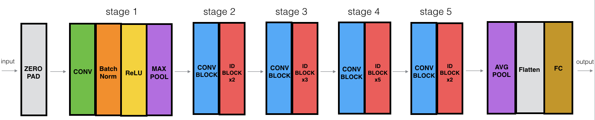
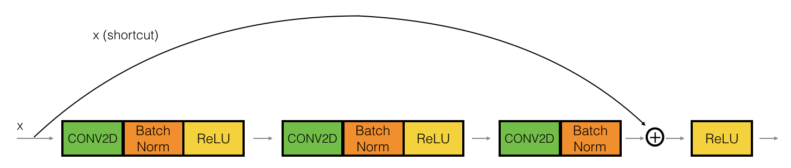

# ResNet50 for handsign recognition
The goal of this project is, given a hand sign image, predict the digit shown in image using ResNet50. The preview of image follows:

## Quick start :
* clone or download the model and run resnet.py
    `resnet.py`
    1. You can train the ResNet on your own.(it took an hour to train the model on 20 epochs using 16gb RAM)
    2. You can load the model (pretrained)
    
    
## Residual Networks:

The ResNet-50 model consists of 5 stages each with a convolution and Identity block. Each convolution block has 3 convolution layers and each identity block also has 3 convolution layers. The ResNet-50 has over 23 million trainable parameters.
### Building Blocks:
 
since X, X_shortcut above are two matrixes, you can add them only if they have the same shape. So if the convolution + batch norm operations are done in a way that the output shape is the same,then we can simply add them as shown above. Otherwise, the x_shortcut goes through a convolution layer chosen such that the output from it is the same dimension as the output from the convolution block as shown below:

 

